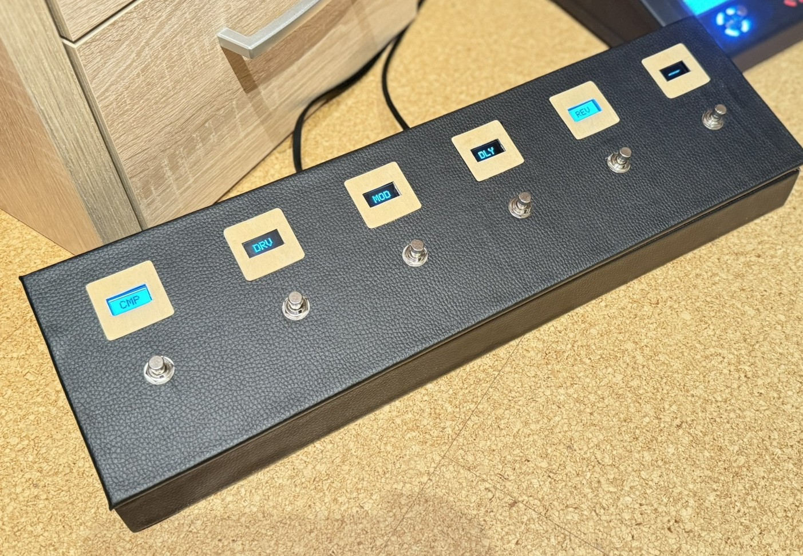
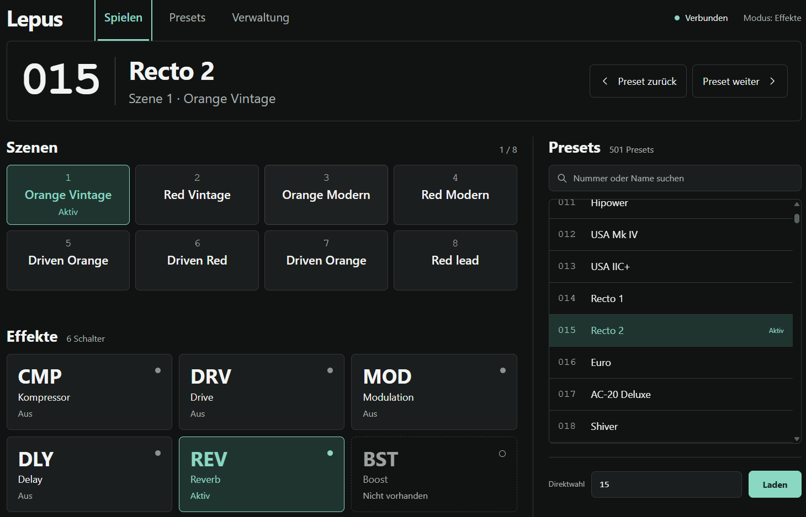
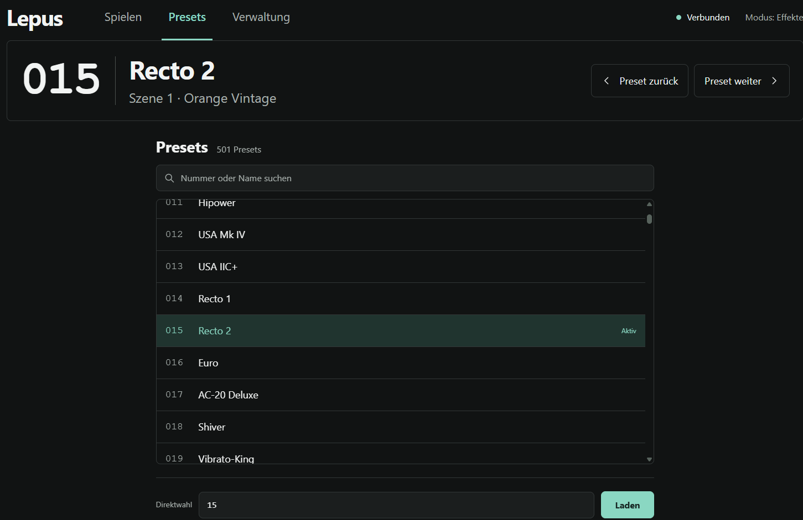
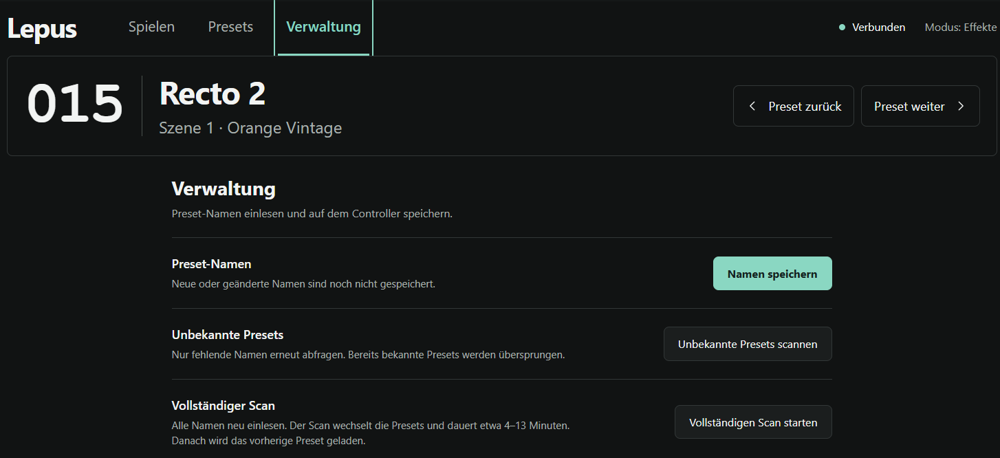
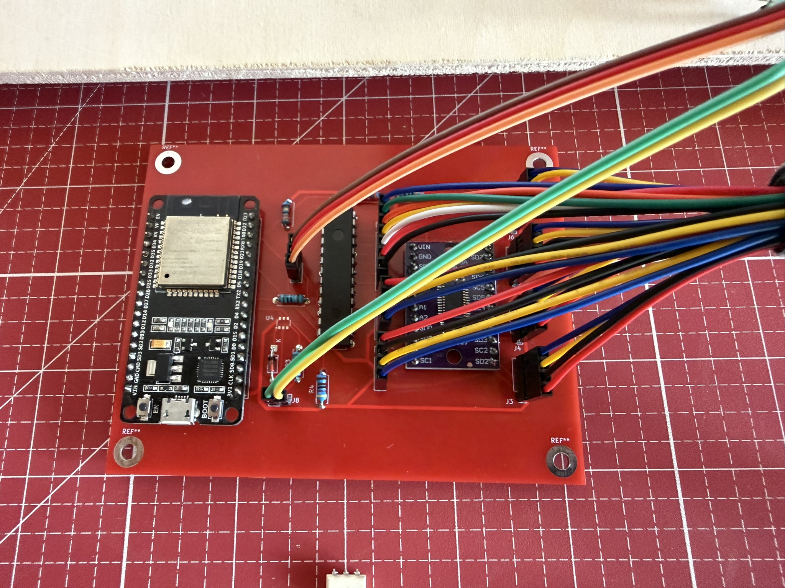

# Lepus MIDI Foot Controller - ESP32 S3 Version

Die ESP32-S3 Version kann auch noch als Midi-Controller für andere USB-Midi-Geräten genutzt werden. Man kann dann zukünftig einen Raspberry-Pi5 mit der Software Pipedal damit steuern. Auch PlugIns (NeuralDSP) am PC könnte man damit dann steuern.

## Weboberfläche

### Seite "Spielen":

### Seite "Presets":

### Seite "Verwaltung":

## PlatformIO

Das Projekt ist für ein **DOIT ESP32 DevKit V1** eingerichtet.

1. PlatformIO in VS Code öffnen und diesen Ordner als Projekt laden.
2. Das Ziel `esp32doit-devkit-v1` auswählen.
3. Das Board per USB anschließen, anschließend **Build** und **Upload** ausführen.
4. Den seriellen Monitor mit 115200 Baud öffnen.

Die Firmware verwendet GPIO 21/22 für I2C und GPIO 16/17 für MIDI. Vor dem
ersten Einsatz `src/NetworkConfig.example.h` nach `src/NetworkConfig.h` kopieren
und dort WLAN-Zugangsdaten und Hostnamen anpassen. Die lokale Konfiguration wird
nicht eingecheckt. Die vorhandenen Zugangsdaten wurden bei der Umstellung übernommen.
PlatformIO lädt die externen Bibliotheken automatisch. AxeFxControl liegt mit
dokumentierten Korrekturen in `lib/AxeFxControl`.

## Aufbau

- `src/LepusMidiController.cpp`: Initialisierung, gemeinsamer Zustand und Hauptschleife.
- `src/Presets.cpp`: MIDI-Synchronisierung, Szenennamen, Scanner und Cachedatei.
- `src/Controls.cpp`: Taster und zentral ausgeführte Steuerbefehle.
- `src/Display.cpp`: OLED-Ausgabe und Laufschrift.
- `src/WebServer.cpp`: validierte HTTP-Endpunkte, Befehlsqueue und Statuskopien.
- `src/web.html`, `src/web.js`: Weboberfläche; beim Build in ein Header eingebettet.

Hardware, MIDI und Cache werden ausschließlich aus der Hauptschleife verändert.
HTTP-Aktionen liefern `202 Accepted` für eingereihte Befehle; der Status wird
anschließend abgefragt. Änderungen verwenden POST. Die bisherigen gemischten
`/api/toggle`-Aufrufe wurden durch `/api/preset` und `/api/effect` ersetzt.
`/api/status` enthält die Cacheversion, `/api/presets` die separat abrufbaren Namen.

## Presets und Speicherung

Der unterstützte Bereich bleibt wie bisher **0–500**, zentral in `Controller.h`
festgelegt. Namen haben Platz für 32 Zeichen plus Nullterminierung. Unbekannt,
bekannt (auch leer) und Timeout werden getrennt gespeichert.

Eine vorhandene `presets.txt` wird übernommen. Beim nächsten Speichern entsteht
`presets.bin`; die alte Textdatei bleibt erhalten. Die Firmware schreibt zunächst
eine temporäre Datei und ersetzt die Zieldatei erst nach erfolgreichem Schreiben.
Bei einem Mountfehler wird LittleFS **nicht automatisch formatiert**. Auf einem
neuen Board muss ein LittleFS-Dateisystem bereitgestellt werden; bei einem bereits
genutzten Board vor einer Neuinitialisierung die bisherigen Daten sichern.

Während des Scans werden andere Bedienbefehle verworfen (Stoppen und Speichern
bleiben möglich). Auch leere Namensantworten schließen einen Scanschritt ab.
Timeouts überschreiben keine bereits bekannten Namen. Nach Scanende oder Abbruch
wird das vorherige Preset wieder gewählt. Ein vollständiger Scan dauert ungefähr
4–13 Minuten. Änderungen direkt am FM3 sollten währenddessen vermieden werden.

## Prüfung

- Firmware: `pio run`
- Native Regressionstests unter Windows mit Visual Studio C++ Build Tools:
  `scripts\test_native.cmd`
- JavaScript-Syntax: `node --check src/web.js`

Die nativen Tests kompilieren die tatsächlich verwendeten Bibliotheksquellen gegen
eine simulierte serielle Schnittstelle. Sie prüfen Parametergrenzen, JSON-Escaping,
Scanfristen einschließlich Timerüberlauf, Namen mit Prozentzeichen und 32 Zeichen,
leere Namen, Szenenabfragen, unveränderte Preset-Neuladungen, Effektlisten sowie
unvollständige, überlange und durch Realtime-Bytes unterbrochene MIDI-Nachrichten.

Vor dem Bühneneinsatz am ESP32/FM3 prüfen: alle sechs Displays und Taster, externe
Preset-/Szenenwechsel, Smart-/Deep-Scan mit Stoppen, Speichern und Neustart,
WLAN-Ausfall und Wiederverbindung. Der Brownout-Schutz bleibt aktiviert.

Vorschläge für die nächste Gestaltung: [docs/WEB_DESIGN.md](docs/WEB_DESIGN.md).

## Platine

Wurde mit KiCad geplant. Bild meiner ersten Version. 

