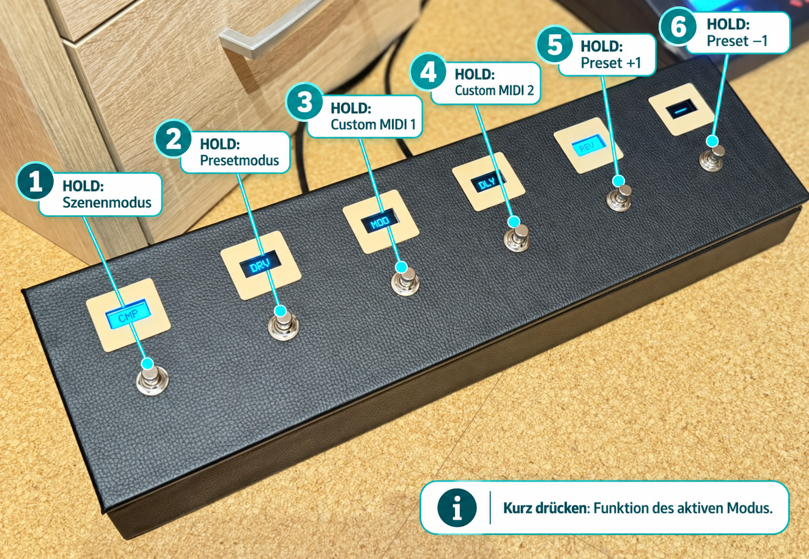
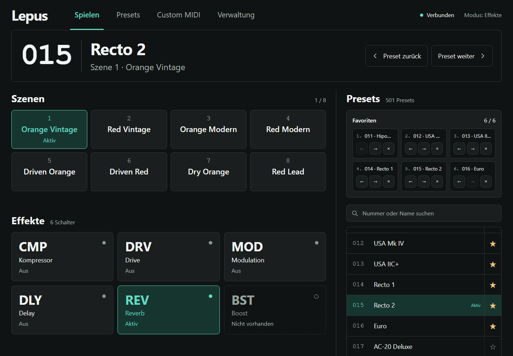
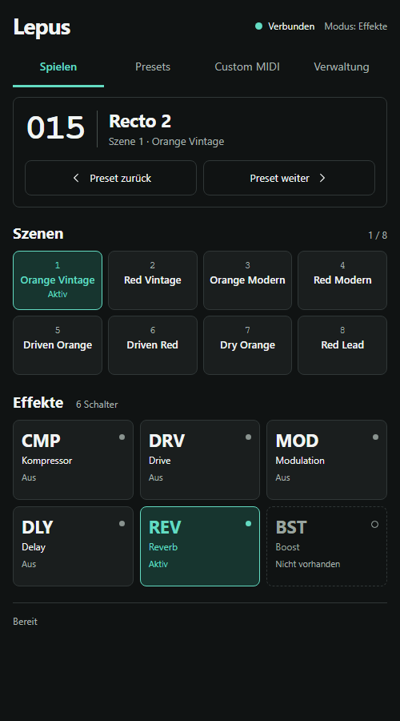
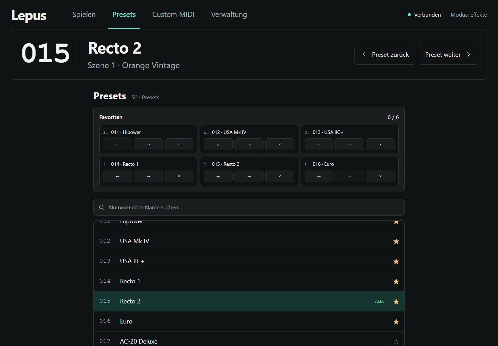
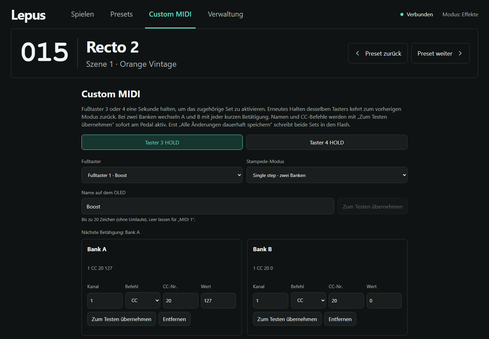
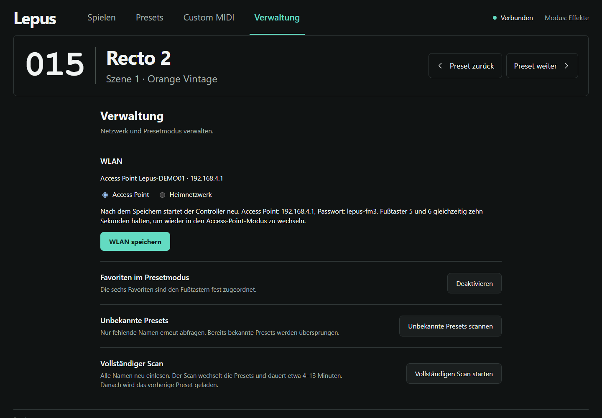

# Bedienungsanleitung · Lepus MIDI-Fußschalter

Diese Anleitung beschreibt die sechs Fußtaster und die Weboberfläche des aktuellen Firmwarestands. Die Bildschirmbilder wurden direkt aus `src/web.html` und `src/web.js` mit Beispieldaten erzeugt. Namen und Zustände am eigenen Gerät können abweichen.

## Die sechs Fußtaster

**Kurz drücken** bedeutet: Taster loslassen, bevor eine Sekunde vergangen ist. Die Aktion erfolgt beim Loslassen. **HOLD** bedeutet: mindestens eine Sekunde gedrückt halten. Nach einem HOLD wird die kurze Aktion nicht zusätzlich ausgeführt.

| Taster | Kurz drücken | Eine Sekunde halten |
| --- | --- | --- |
| 1 | Funktion des aktuellen Modus | Zwischen Effekt- und Szenenmodus wechseln |
| 2 | Funktion des aktuellen Modus | Presetmodus einschalten; erneutes Halten schaltet zum Szenenmodus |
| 3 | Funktion des aktuellen Modus | Custom-MIDI-Set 1 einschalten; erneutes Halten kehrt zum vorherigen Modus zurück |
| 4 | Funktion des aktuellen Modus | Custom-MIDI-Set 2 einschalten; erneutes Halten kehrt zum vorherigen Modus zurück |
| 5 | Funktion des aktuellen Modus | Preset um eins erhöhen |
| 6 | Funktion des aktuellen Modus | Preset um eins verringern |

**Taster 5 und 6 zusammen zehn Sekunden halten:** Die Netzwerkeinstellung wird auf den Access-Point-Modus zurückgesetzt. Die Kombination löst keine kurzen Tasteraktionen aus.

### Was ein kurzer Tastendruck bewirkt

| Modus | Taster 1–6 |
| --- | --- |
| Effekte | Den jeweils angezeigten Effekt ein- oder ausschalten, sofern er im Preset vorhanden ist. Dies ist der Startmodus. |
| Szenen | Szene 1–6 wählen. |
| Presets | Entweder die sechs gespeicherten Favoriten oder Presets relativ zum aktuellen Preset wählen. Ohne aktive Favoriten entsprechen die Taster 1–6 den Offsets −2, −1, 0, +1, +2, +3. |
| Custom MIDI | Den eingestellten CC-Befehl des gewählten Sets senden. Bei zwei Banken wechseln kurze Tastendrücke zwischen A und B. |

## Erster Zugriff auf die Weboberfläche

1. Controller einschalten und das WLAN **Lepus-XXXXXX** wählen. Die letzten sechs Zeichen sind geräteabhängig.
2. Das WLAN-Passwort **lepus-fm3** eingeben.
3. Im Browser **http://192.168.4.1** öffnen.
4. Unter **Verwaltung → WLAN** kann der Controller später mit einem Heimnetz verbunden werden. Nach dem Speichern startet er neu.

Wenn das Heimnetz 30 Sekunden lang nicht erreichbar ist, erscheint der Access Point wieder. Mit Taster 5 und 6 lässt sich der Access-Point-Modus dauerhaft wiederherstellen.

## Spielen

Oben stehen Presetnummer, Presetname und aktive Szene. **Preset zurück** und **Preset weiter** wechseln das Preset. Darunter können acht Szenen sowie die sechs Effektschalter direkt gewählt werden. Türkis kennzeichnet aktive Elemente; ein gestrichelter Effektschalter ist im Preset nicht vorhanden. Rechts sieht man Favoriten und die Presetliste.

Auf schmalen Bildschirmen zeigt **Spielen** die Bühnenbedienung als eigene Ansicht:

## Presets und Favoriten

In **Presets** nach Nummer oder Namen suchen, einen Eintrag wählen oder mit **Direktwahl** eine Nummer von 0 bis 500 laden. Ein Stern fügt das Preset in den ersten freien Favoritenplatz ein. Die Pfeile in einem Favoritenplatz ändern die Reihenfolge; **×** entfernt den Eintrag. Die Plätze 1–6 gehören zu den Fußtastern 1–6.

Unter **Verwaltung → Favoriten im Presetmodus** wird zwischen Favoritenbelegung und relativer Presetwahl umgeschaltet. Ist der Favoritenmodus aktiviert, aber noch kein Favorit belegt, bleibt die relative Belegung wirksam. Bei teilweise belegten Favoriten haben leere Plätze keine Presetaktion.

## Custom MIDI einstellen

1. In **Custom MIDI** das Set für **Taster 3 HOLD** oder **Taster 4 HOLD** auswählen.
2. Einen der sechs Fußtaster wählen und bei Bedarf den Namen für dessen OLED ändern. Zulässig sind bis zu 20 Zeichen ohne Umlaute.
3. **Single step · eine Bank** sendet bei jedem kurzen Druck Bank A. **Single step · zwei Banken** wechselt zwischen A und B.
4. Pro Bank MIDI-Kanal (1–16), CC-Nummer und Wert (je 0–127) eintragen und mit **Zum Testen übernehmen** am Pedal ausprobieren.
5. Abschließend **Alle Änderungen dauerhaft speichern** wählen. Erst dieser Schritt sichert beide Sets über einen Neustart hinweg.

## Verwaltung

Unter **WLAN** zwischen Access Point und Heimnetz wählen. Für das Heimnetz SSID und Passwort eingeben; DHCP kann aktiv bleiben oder durch feste IP-Adresse, Gateway, Subnetzmaske und DNS-Server ersetzt werden. **WLAN speichern** startet den Controller neu.

**Unbekannte Presets scannen** fragt nur fehlende Namen ab. **Vollständigen Scan starten** liest alle Namen neu ein und dauert ungefähr 4–13 Minuten. Während des Scans ist die Spielsteuerung gesperrt. Er kann gestoppt werden; danach wird das vorherige Preset wieder gewählt. Neue Presetnamen mit **Namen speichern** dauerhaft sichern.

## Vorschau ohne Controller

[Interaktive Webvorschau öffnen](preview/index.html). Diese Seite enthält denselben HTML-, CSS- und JavaScript-Code wie die Firmware, nutzt aber simulierte Gerätedaten. Die Bedienoberfläche lässt sich damit am Computer ansehen; MIDI-Befehle werden dabei nicht an Hardware gesendet.
